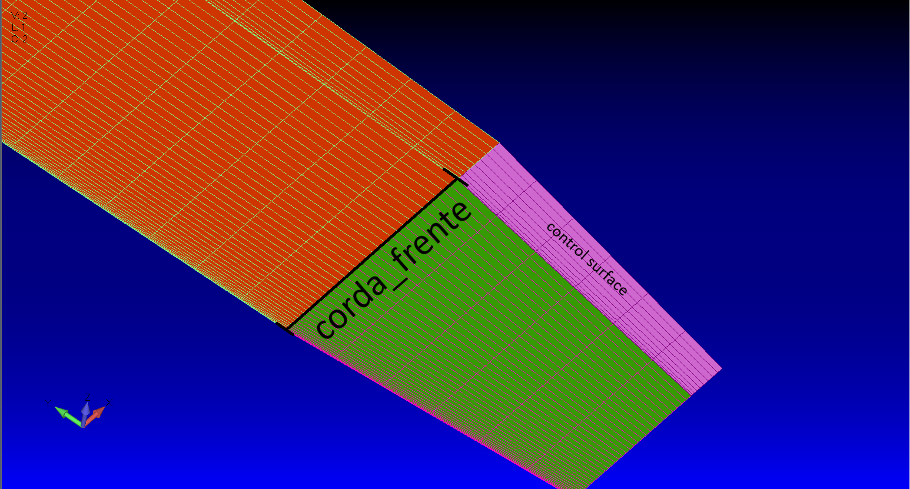
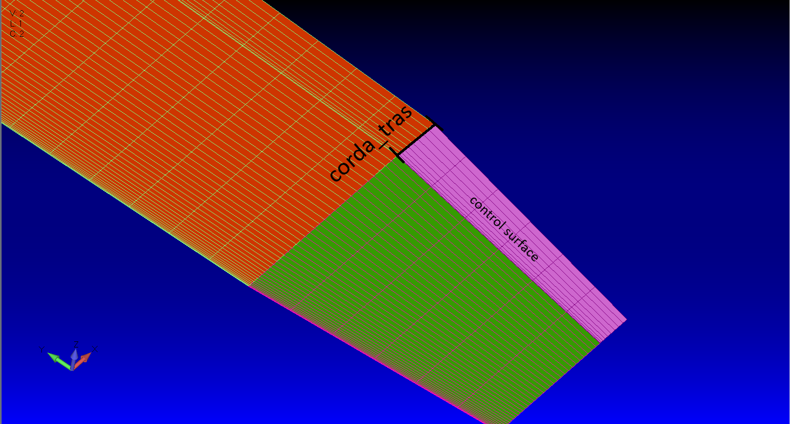

# DLM Aerodynamic Mesh Generator (Panel & Aileron)

> **Code originally developed by Prane (2025).**

This Python script automates the generation and discretization of two-dimensional aerodynamic meshes for the **Doublet Lattice Method (DLM)** used in aeroelastic analyses. Its main focus is to maintain perfect physical continuity between two consecutive sections (Fore Panel and Aft Panel/Aileron), allowing strategic node refinement via sine/cosine laws.

---

## What Does the Code Do?

1. **Calculates the Real Proportion:** Divides the requested number of panels based on the actual physical dimensions of the chords (`corda_frente` and `corda_tras`).
2. **Refines the Edges:** Applies mathematical transformations to "squeeze" the panels close to the junction and the Trailing Edge (TE), ensuring higher accuracy where air flow changes abruptly.
3. **Unifies and Normalizes:** Joins both blocks into a continuous "Full Panel" that scales perfectly from `0.000000` (Leading Edge) to `1.000000` (Trailing Edge).
4. **Exports Everything to Excel:** Generates an `.xlsx` file locked to 6 decimal places, ready to be copied or imported into your aeroelasticity software.

---

## How to Use (Step-by-Step)

### 1. Prerequisites and Dependencies
The code requires the `numpy`, `pandas`, and `xlsxwriter` libraries. 
* **Automatic Installation:** The first time you run it, the script itself will detect if anything is missing and ask in the terminal if you want to install it automatically (`[Y/N]`).
* **Manual Installation:** If you prefer to do it yourself via the terminal:
  ```bash
  pip install numpy pandas xlsxwriter
  ```

### 2. Configuring the Variables 
Open the script and scrool to the end, under the `CONFIGURAÇÕES INICIAIS` (Initial Configurations) section. You only need to change three variables:

  - `"corda_frente"`: The actual physical length of the section in front of your control surface as shown bellow.

    

  - `"corda_tras"`: The actual physical length of your control surface.

    

  - `"num_paineis_corda"`: How many panels you want across the entire chord. (The code will automatically split this amount proportionally between the front and the rear).


### 3. Running the Script
Run the Python script through your terminal or IDE:

```bash
  python caralinho aerodinamico.py
```
If everything goes well, the message "Planilha Excel gerada com sucesso!" (Excel spreadsheet generated successfully!) will appear in the terminal.

--- 

## Understanding the Generated Spreadsheet (`malhanew.xlsx`)

| Column | What does it mean? | Scale |
| :-----------: | :-----------: | :-----------: |
| Painel Frente | Mesh of the front section normalized in isolation. | Ranges from `0` to `1`. |
| Aileron | Mesh of the rear secton normalized in isolation. | Ranges from `0` to `1`. |
| Painel Inteiro | The actual unified mesh. Both parts added up and normalized together. | Starts at `0.000000` and ends exactly at `1.000000`. |

> **Note on Duplicate Nodes:** In the **"Painel Inteiro"** (Unified Panel) column, you will notice a duplicate coordinate value exactly at the junction between the two sections. This happens because the concatenation combines the last point of the front panel and the first point of the aileron, which mathematically share the exact same physical position (the hinge/transition line). Depending on the specific requirements of your DLM solver, you may need to filter out this duplicate point or keep it as the shared boundary node.

---

## ⚠️ Important Notices

 - Do not remove the dependency verification function if you are sharing this code with others (it saves them a headache).

 - If the 3D geometric mesh shows gaps or misalignments ("steps"), double-check that the values entered in corda_frente and corda_tras match the exact actual coordinates plotted in your CAD/Modeling software.
